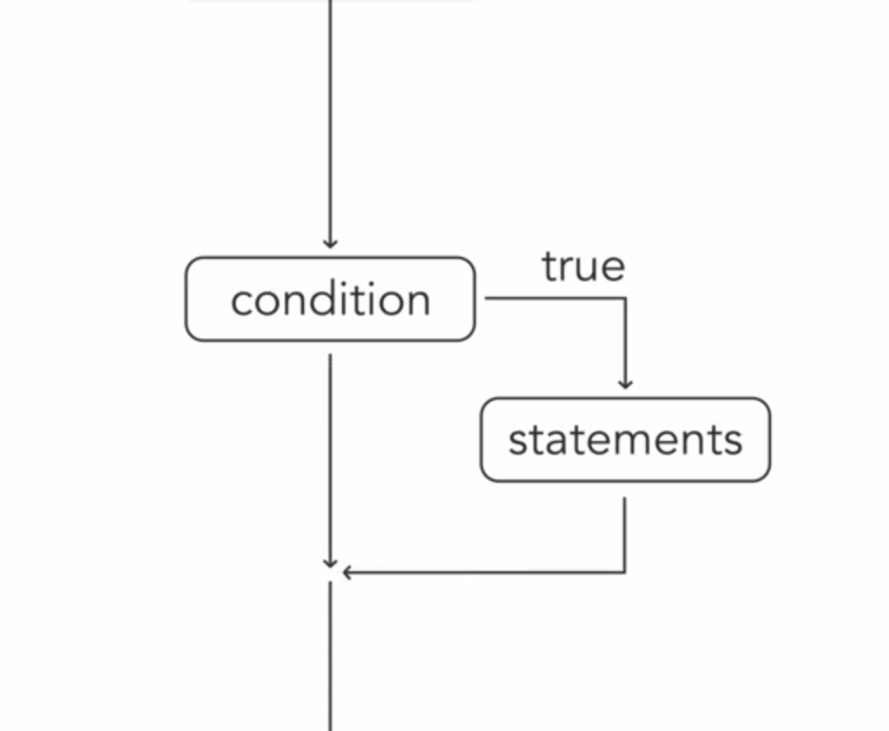

# fundamentals
#The first course of Programming Foundation Series on LINKEDIn Learining with كالبينان المرصوص intership.

# 01. Fundamentals

Instructor: Annyce Davis
Link: https://www.linkedin.com/learning/programming-foundations-fundamentals-3?contextUrn=urn%3Ali%3AlyndaLearningPath%3A56db2b643dd5596be4e4989b

- **Some Resources:**
    - **No Resources Here**

# **Introduction**

---

# **1- Programming Basics**

- **What is programming?**

    **Programing:** is converting an idea into a set of instructions that a computer can execute, These Instructions are specific and sequential.

    **Bug:** Something unexpected happens.

    **Crash:** Stops early or freezes.

- **What is a programming language?**

    Each Lang has Syntax ⇒ Rules, Semantics ⇒ Meaning

    Why do we have many programming languages? It's because; Each lang has Pros & Cons.

    ```cpp
    cout>>"
    ```

    ```python
    print("Hello, Isalmic world!")
    ```

    ```python
    print("Hello, Isalmic world!")
    ```

- **Writing source code**

    ```python
    print("Hello, Isalmic world!")
    ```

- **Running your code**

    **Compiling:** translate your high-level code to machine code (0101), by making a low-level version of your code, without the need for the source code anymore.

    **like:** C, C++, and Objective-C

    **Interpreting:** translate your code line by line to low-level lines each time you run it, and it needs your source code every run. 

    **like:** PHP, and JavaScript

    **Combination:** use both.

    **like:** Python, C#, and Java

- **Using an IDE**

    **I**ntegrated **D**evelopment **E**nvironments 

    Provides special tools to help: Debug, Compile, and write.

- **Chapter Quiz14 questions**

    Source code is written in rich text. ⇒ False

---

# **2- Programming Syntax**

- **Why Python?**

    Most popular languages is Java, Python, JavaScript, C++, C#

    Python, JavaScript =  Concise: Less lines of code do make things done.

    JavaScript = was designed to work with web apps

    Python = General purpose lang Web apps, companies system, games, etc.

    ```python
    print("Hello world!")
    ```

- **Running Python on the command line on Mac (Change Title)**

    Syntax = The rules of a programming language

- **Basic statements and expressions**

    Program = Number of Statements = Keywords + Expressions + Operators

    Operand1(5) Operator(*) Operand2(4) = 5 * 4 = Expressions

    PEMDAS =  **P**lease **E**xcuse **M**e **D**ear **A**unt **S**ally

    Parentheses, Exponents, Multi, Div, Add, Substraction

- **Troubleshooting issues**

    > "There are two ways to write error free programs, "only the third one works."  **Alan Perlis**

    We have three types of errors 
    **Syntax:** you somehow broke the rules of the language. 

    ```python
    print("Hello world")
    ################################
    x = 5
     print("x")
    ```

    **Runtime:** the computer was unable to execute a portion of your code. 

    ```python
    10 * (2/0)
    ################################
    name = "It's me!"
     print("Hello.", Name)
    ```

    **Semantic:** the output of the program is not what you expected.

    ```python
    name = "Alice"
    print("Hello name")
    ```

---

# **3- Variables and Datatypes**

- **Introduction to variables and data types**

    = Sign not Equals

- **Variables across languages**

    **Variables Name**: Letters, Numbers(not at the first), and underscores

    Can't be keyword.

- **Working with numbers**

    Mathimatical Operators is 8, +, -, /, %
    3**3 = 3^3 = 27     ||||       3//2 (Give me result with out remainders) Opposite of 3%2(Give me only the reminder)

    **Float =**  is any number with a decimal point.

- **Challenge: What's the output?**

    Challenge 1:

    This is going to be tricky ;)

    2**3 = 8

    Challenge complete!

---

# **4- Conditional Code**

- **Making decisions in code**

    **Conditional or Boolean** : Any expression that it's answer it true or false

    Relational operators: operand1 (operator) operand2 ⇒ True/False

    Equality:  operand1 (= =)(! =) operand2 ⇒ True/False

    Greatness: operand1 (>/<)(> =/< =) operand2 ⇒ True/False

- **Exploring conditional code**

    ```python
    if condition:
    	do work #indented = block
    	do work #indented = block
    do work #not indented != block
    end if
    ```

    

- **Working with simple conditions**

    ```python
    if condition:
    	do work
    else: 
    	do work

    ```

- **Challenge: Guessing game**

    ```python
    favFood = chicken
    answer = input("What is your favourite food?(Chicken, Bashmel, rise or meat")
    if answer = favFood:
    	print("Yeah!! You're RIGHT ='D, My favroute food is ", favFood)
    else:
    	print("Oops!! You're WRONG ='(, My favourite food is'nt " answer)
    print("Thanks For Playing <'3")
    ```

    ```python
    favFood = "chicken"
    answer = input("What is your favourite food?(chicken, bashmel, rise or meat) ")
    if answer == favFood:
        print("Yeah!! You're RIGHT ='D  , My favroute food is ", favFood)
    elif answer == "idk":
        print("My favroute food is ", favFood)
    else:
    	print("Oops!! You're WRONG ='(  , My favourite food is'nt ", answer)
    print("Thanks For Playing <'3")
    ```

---

# **5- Modular Code**

- **Challenge: Favorite cities**

    ```python
    def favoriteCity(cityName):
        favCity = print("My favorite city is :", cityName)
        return favCity
    name = input("What is your name? ")
    print(name, "Please,")
    cityName = input("Enter your favorite city name ")

    favoriteCity(cityName)
    favoriteCity(cityName)
    favoriteCity(cityName)
    ```

---

# **Conclusion**

“Programming Foundations: Fundamentals”!

### نظرة عامة:

بسيط، واضح، محدد، طريقة العرض والشرح رائعة.

### الفئة المُستهدفه من الكورس:

لمن لا يعرف شئ تماماً عن البرمجه وبالتأكيد اللي مستواه كويس ومتعرضش لحاجه تأسيسيه من قبل.

### المُحاضر و الأسلوب:

المُحاضِره أسلوبها مرح و سلس جداً، أسرد الأن بعد المُميزات في أسلوب الكورس

1. لما بتيجي تعرض أي **مفهوم برمجي**، بتشبهه بحاجه معروفه لكل الناس مثلاً: وصفة كيكا، حاجه في المطبخ، مغلسة العربيات، حوار مع واحد صاحبك، شات، المهم هتلاقي حاجات بتقابلها في يومك وده اسلوب رائع **للتقريب** ويخليك تشرب المفاهيم المُعقده كشربه ماء
2. لما بتعمل حاجه روتينيه بسيطه جدًا زي لما تيجي تعمل Run لكود بتشرحها كل مرة تعمل فيها Run للكود وبطريقه مش ممله وهتحسها بتثبت معاك الحاجه دي ولو انت مبتدأ ومتعرفهاش انسى انك تتلخبط فيها تاني
3. لما بتيجي تشرح حاجه جديدة في اللغة، بتبدأ تخلق مشكلة وتخليك تحس بالمشكله، بعدين تعرضلك الحاجه الجديده علي هيئة الحل، ودي فايده جميلة جدًا في توضيح ماورائيات الأشياء واظن ده اللي بيفرق بين الفاهم والمُقلد..

انت هتطلع من الكورس كل مفهوم عرفته فاهمه كويس وفاهم ليه تستخدمه هو بعينه مش حاجه تانية و**في أقل من 3 ساعات تقريباً !!** شئ مُذهل مش كده؟

ولو انت وصلت لهنا فـ انا احب اشارك معاك تلخيصي لأهم نقط من وجة نظري في الكورس ده في صفحة نوشن هنا عساها تفيدك لو فكرت تاخد الكورس :
